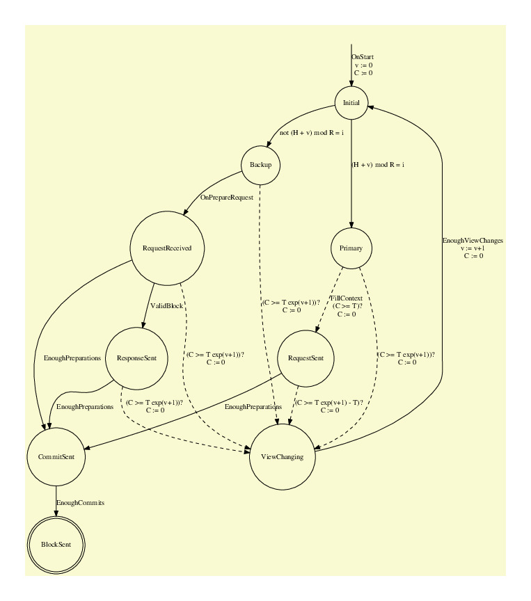
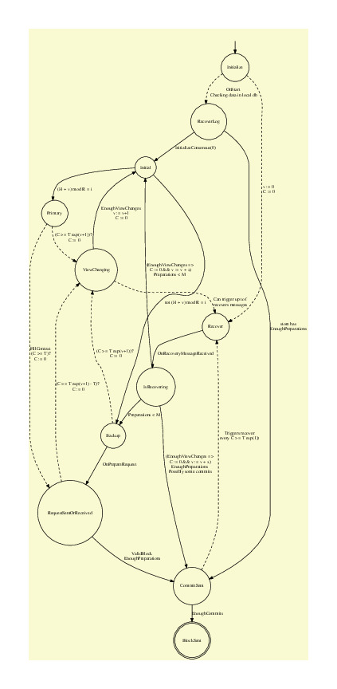

# Delegated Byzantine Fault Tolerance: Technical details, challenges and perspectives {#sec:dBFT}

Several studies in the blockchain literature have explored partially synchronous and fully asynchronous Byzantine Fault Tolerant (BFT) systems [@Hao2018DynnamicPBFT; @Duan:2018:BAB:3243734.3243812; @miller2016honey].
However, few of them have been applied in a real-world Smart Contract (SC) scenario - i.e. where multiple distinct decentralized applications use the same BFT system.

Distinct to other prior works in the literature, NEO proposes a BFT consensus mechanism with **one block finality** in the **first layer** [@Neo2015WP].
One block finality offers significant advantages for real-world applications - For example, end users, merchants, and exchanges can be confident that their transactions were definitively processed and that there is no chance for them to be reverted.
While the NEO Ecosystem has been designed for hosting Decentralized Applications (DApps), it is noteworthy that persisting SC transactions (which involves State Machine Replication (SMR) and is the core functionality of several DApps) poses a unique set of challenges.
DApps utilising SCs tend to be more complex to develop and optimize when compared to DApps focused only on appending storage [@schneider1990implementing].
Besides its significant advantages, satisfying this set of requirements poses additional constraints, vulnerabilities and challenges when compared to other consensus applications dealt in the literature.

The goal of this technical material is to highlight the main adaptations from the classical Practical
Byzantine Fault Tolerance (pBFT) to the Delegated Byzantine
Fault Tolerance (dBFT) currently used in the NEO blockchain core library (see [Neo Project Github](https://github.com/neo-project/neo)).
Furthermore, it describes a novel mathematical model that is able to verify specific consensus behavior by means of a discrete model which can simulate its operation in real cases.
While highlighting the positive aspects of the current NEO consensus system,  this document also has the goal of pointing out possible faults and future research & development directions.
The latter can be achieved by a combination of NEO's requirements and novel ideas in connection with well-known studies from the literature.

The remainder of this document is organized as follows.
[Section @Sec:Background] provides a brief background on the classical pBFT.
[Section @Sec:NEOdBFT] describes the key modification made from the literature for the achievement of NEO's dBFT.
[Section @Sec:dBFTDetails] details the current state-of-the-art discussions regarding NEO's dBFT, and presents didactic pseudocodes and flowcharts.
Finally, [Section @Sec:dBFT_MILP] proposes a novel mathematical programming model based on Linear Integer Programming, which models an optimal adversary that will challenge the network and verify its limitations in worst case scenarios.

## Background on Practical BFT {#sec:Background}

Practical BFT was first made possible by the work of Miguel Castro and Barbara Liskov (see [Figure @Fig:bliskov]), entitled "Practical Byzantine Fault Tolerance" [@castro1999practical].

{height=200px}

Given $n=3f+1$ replicas of a State Machine, organized as Primary and Backup nodes, the proposed algorithm guarantees _liveness_ and _safety_ to the network, if at most $f$ nodes are faulty/Byzantine^[The name Byzantine refers to arbitrary behavior, and was coined by Leslie Lamport and others in the paper "The Byzantine Generals Problem"].

* Safety property ensures that all processes will execute as atomic, either executing on all nodes, or reverting as a whole. This is possible due to the deterministic nature of the process (executed on every node), which is also valid for the NEO network and blockchain protocols in general.

* Liveness guarantees that the network won't be stopped (unless more than $f$ byzantine nodes exist), by using a mechanism called "change view", which allows Backup nodes to switch Primary node when it seems Byzantine, as well as when quorum of the majority is not achieved.
A timeout mechanism is used, and by doubling delays exponentially at every view, pBFT can prevent attacks from malicious network delays that cannot grow indefinitely.
In the current formula, timeout happens following a left-shift operator according to the current view number, for example:

  * Considering 15 second blocks: 15 << 1 is 30s (first change view); 15 << 2 is 60s; 15 << 3 is 120s; 15 << 4 is 240s.
  * Considering 1 second blocks: 1 << 1 is 2s; 1 << 2 is 4s; 1 << 3 is 8s; 1 << 4 is 16s.

In addition, timeout is postponed each time that the protocol detects that nodes are reaching an agreement on the current block.
For example, it is currently set to around 40% of block time when `PrepareRequest` or `PrepareResponse` payloads are received, while
80% for `Commits`.
The reasoning behind this is that CN can delay their timeouts when they believe in the current network topology.
Thus, timeout may have two time parcels, one fixed (according to the current view) and another one that is represented in terms of increments.
It should be noticed that the fixed portion do not increase until the node does not move to a higher view.
Timers might expire more than 1 time for each view, rebroadcasting its current change view request.
Without loss of generality this can happen since change view is considered to be a locked state.

Regarding the locked state, it should be noticed that after requesting `ChangeView` the node still can be unlocked.
The latter happens only in a special condiction, in which, at least, `F` nodes are known as lost or committed.

The considered network on pBFT assumes that it "may fail to deliver messages, delay them, duplicate them, or deliver them out of order." They also considered public-key cryptography to validate the identity of replicas, which is also the same for NEO dBFT.
Since the algorithm does not rely on synchrony for safety, it must rely on it for liveness^[This was demonstrated by paper "Impossibility of distributed consensus with one faulty process"].
The resiliency of $3f+1$ is optimal for a Byzantine Agreement [@BrachaToueg1985], with at most $f$ malicious nodes.

pBFT correctness is guaranteed by having three different phases: pre-prepare, prepare and commit^[NEO dBFT 2.0 also consists of three phases, with a slight naming change: prepare request, prepare response, and commit].

* On pre-prepare, primary sends a sequence number $k$ together with message $m$ and signed digest $d$.
Backup $i$ accepts pre-prepare if the signature is correct, $k$ is in the valid interval^[A special technique avoids the exhaustion of sequence number space by faulty primary], and $i$ has not yet accepted a pre-prepare for the same $k$ and the same view.

* When pre-prepare is accepted, a prepare message is broadcast (including to primary), and a node is considered `prepared` when it receives at least $2f$ prepare messages that match its local pre-prepare, for the same view.
So, at this point, for a given view, the non-faulty replicas already agree on the total order for requests.
As soon as $2f +1$ non-faulty nodes are `prepared`, the network can be considered as `committed`.

* Every `committed` replica broadcasts a commit message, and as soon as node $i$ has received $2f+1$ commit messages, node $i$ is `committed-local`. It is guaranteed that, eventually, even with the occurrence of change views, a system with `committed-local` nodes will become `committed`.

pBFT considers that clients interact and broadcast messages directly to the primary node, then receiving independent responses from $2f+1$ nodes in order to move forward (to the next operation).
This is a similar situation for NEO blockchain, where information is spread by means of a peer-to-peer network, but in this case, the location of consensus nodes is unknown (in order to prevent direct delay attacks and denial of service).
One difference is that, for pBFT, clients submit atomic and independent operations for a unique timestamp, which are processed and published independently.
For NEO blockchain, consensus nodes have to group transactions into batches, called blocks, and this process may lead to the existence of thousands of valid blocks for the same height, due to different groupings (different combinations of transactions).
So, in order to guarantee block finality (a single and unique block can exist in a given height), we may have to consider situations where the "client" (block proposer) is also faulty, which is not considered in pBFT.

## NEO dBFT core modifications {#sec:NEOdBFT}

 In summary, we highlight some differences between pBFT and dBFT:

* One block finality to the end-users and seed nodes;
* Use of cryptographic signatures during different phases of the procedures in order to avoid exposure of nodes commitment to the current block;
* Ability to propose blocks based on information shared through block headers (transactions are shared and stored in an independent syncronization mechanism);
* Avoid double exposure of block signatures by not allowing view changes after the commitment phase;
* Regeneration mechanism able to recover failed nodes both in the local hardware and in the network P2P consensus layer.


<!-- In this sense, novel tools and strategies can still be incorporated in the current dBFT in order to design an even more robust and reliable multi-agent agent based consensus mechanism. -->


## dBFT detailed description {#sec:dBFTDetails}

The dBFT consensus mechanism is a state machine, with transitions depending on a round-robin scheme (to define Primary/Backup nodes) and also depending on network messages.

### dBFT states

dBFT states are the following:

* Initial : initial machine state

* Primary : depends on block height and view number

* Backup : true if not primary, false otherwise

* ~~RequestSent : true if block header has been proposed, false otherwise~~ (removed on dBFT 2.0 since code tracks all preparation signatures, merged as RequestSentOrReceived)

* ~~RequestReceived : true if block header has been received, false otherwise~~ (removed on dBFT 2.0 since code tracks all preparation signatures, merged as RequestSentOrReceived)

* ~~SignatureSent : true if signature has been sent, false otherwise~~ (removed on dBFT 2.0 because of extra commit phase carrying signatures)

* RequestSentOrReceived : true if a valid signature of Primary has been received, false otherwise (introduced in dBFT 2.0).

* ResponseSent : true if block header confirmation has been sent (introduced in dBFT 2.0: internal state used only for blocking node to triggering consensus OnTransaction event)

* CommitSent : true if block signature has been sent (this state was only introduced in dBFT 2.0 and replaced SignatureSent)

* BlockSent : true if block has been sent, false otherwise

* ViewChanging : true if view change mechanism has been triggered, false otherwise

* MoreThanFNodesCommittedOrLost : true in the case that more than `F` nodes are locked in the committed phase or considered to be lost (introduced in dBFT 2.0).

* IsRecovering : true if a valid recovery payload was received and is being processed (introduced in dBFT 2.0: internal state)


The first dBFT handled these states explicitly as flags (ConsensusState enum).
However, dBFT 2.0 can infer this information in a implicit manner, since it has added a track of preparations signatures and state recovery mechanisms.

## Flowchart

[Figure @Fig:dbft-sm] presents the State Machine replicated on each consensus node (the term _replica_ or _node_ or _consensus node_ may be considered synonyms for this subsection).
The execution flow of a State Machine replica begins on the `Initial` state, for a given block height `H` on the blockchain.
Given `T` as standard block time (15 seconds); `v` as current view number (starting from $v=0$); $exp(j)$ is set to $2^j$; `i` as consensus index; `R` as total number of consensus nodes.
This State Machine can be represented as a Timed Automata [@AlurDill:1994], where `C` represents the clock variable and operations `(C condition)?` represent timed transitions (`C:=0` resets clock).
Dashed lines represent transitions that explicitly depend on a timeout behavior and were included in a different format for clarity.
It is also assumed that transitions are processed *in the order* they are presented. For example:

```
 (C >= 5)?
 A
 (C >= 7)?
 B
```

This block would first wait until clock `C` has over 5 seconds, then process `A`, then check clock to meet 7 seconds, and then process `B`.
This allows a more precise description of the actual dBFT 2.0 implementation.

Let's start with original PBFT, on [Figure @Fig:pbft]. `$(message)` means message is signed.
 Dashed lines indicates timeouts or alternative transitions (only on fail states). `CKP` means checkpoint (related to `n`, `s`, `h'` and `H'`).

<!-- BEGIN COMMENT -->


<!-- END COMMENT -->

~~~ {.graphviz
     #fig:pbft caption="Basic structure for PBFT" width=90% filename="graphviz-pbft"}
digraph PBFT {
  graph [bgcolor=lightgoldenrodyellow]
        //rankdir=LR;
        size="11";
  EmptyClient [ label="", width=0, height=0, style = invis ];
  node [shape = circle]; InitialClient;
  node [shape = doublecircle]; RequestExecuted;
  Empty [ label="", width=0, height=0, style = invis ];
	node [shape = circle]; Initial;
	node [shape = doublecircle]; committed_local_m_v_n_i;
	node [shape = circle];
  EmptyClient -> InitialClient;
  InitialClient -> RequestSentToReplica [ label = "client c sends \n $(REQUEST,o,t,c) \n with timestamp t \n to primary \n C' := 0"];
  RequestSentToReplica -> RequestSentToReplica [ label = "(C' > T')? \n retransmit \n C' := 0" ];
  RequestSentToReplica -> RequestExecuted [ label = "client receives f+1 (REPLY)"];
  Empty -> Initial [label = "OnStart \n v := 0\n C := 0"];
	Initial -> Primary [ label = "v mod R = i" ];
  Initial -> Backup [ label = "not v mod R = i" ];
  Primary -> prepare [ label = "client c sends \n $(REQUEST,o,t,c) \n with timestamp t \n n := assign_seq_number \n broadcast ((PREPREPARE,v,n,d),m)" ]
  Backup -> Initial [ label = "v+1 mod R = i \n received 2f (VIEW_CHANGE,v+1) \n broadcast $(NEW_VIEW, v+1, 2f+1 proof) \n v := v + 1"];
	Backup -> prepare [ label = "received ((PREPREPARE,v,n,d),m) \n h' < n < H' \n in_view(v) \n not accepted other PP with \n same v and different d \n broadcast signed (PREPARE,v,n,d,i) \n C := 0" ];
  prepare -> ViewChanging [ label = "(C >= T)? \n broadcast \n $(VIEW_CHANGE,v+1,n=s,CKP,i)", style="dashed" ];
  ViewChanging -> Initial [ label = "received (NEW_VIEW, v+1, 2f+1)\nv:=v+1" , style="dashed"];
  prepare -> prepared_m_v_n_i [ label = "received 2f PREPARE from backups" ];
  prepare -> Initial [ label = "received (NEW_VIEW, v+1, 2f+1)\nv:=v+1" , style="dashed"];
  prepared_m_v_n_i -> commit [ label = "broadcast $(COMMIT,v,n,D(m),i)" ];
  commit -> committed_local_m_v_n_i [ label = "has 2f+1 commits \n execute operation" ];
  commit -> Initial [ label = "received (NEW_VIEW, v+1, 2f+1)\nv:=v+1" , style="dashed"];
  committed_local_m_v_n_i -> Initial [ label = "send to client c \n $(REPLY,v,t,c,i,r)"];
}
~~~


Let's switch to  dBFT now.

<!-- BEGIN COMMENT -->



<!-- END COMMENT -->

~~~ {.graphviz
    #fig:dbft-sm caption="dBFT 2.0 State Machine for specific block height" width=90% filename="graphviz-dbft-sm"}
digraph dBFT {
  graph [bgcolor=lightgoldenrodyellow]
        //rankdir=LR;
        size="11";
  Empty [ label="", width=0, height=0, style = invis ];
	node [shape = circle]; Initial;
	node [shape = doublecircle]; BlockSent;
	node [shape = circle];
  Empty -> Initial [label = "OnStart\n v := 0\n C := 0"];
	Initial -> Primary [ label = "(H + v) mod R = i" ];
	Initial -> Backup [ label = "not (H + v) mod R = i" ];
	Primary -> RequestSentOrReceived [ label = "(C >= T)? \n SendPrepareRequest \n C := 0", style="dashed" ];
	Backup -> RequestSentOrReceived [ label = "OnPrepareRequest \n ValidBlock" ];
	RequestSentOrReceived -> CommitSent [ label = "EnoughPreparations" ];
	CommitSent -> BlockSent [ label = "EnoughCommits" ];
	ViewChanging -> Initial [ label = "EnoughViewChanges\n v := v+1 \n C := 0" ];
  RequestSentOrReceived -> ViewChanging [ label = "(C >= T exp(v+1))?\n C := 0", style="dashed" ];
  Primary -> ViewChanging [ label = "(C >= T exp(v+1))?\n C := 0", style="dashed" ];
	Backup -> ViewChanging [ label = "(C >= T exp(v+1))?\n C := 0", style="dashed" ];
}
~~~


On [Figure @Fig:dbft-sm], consensus node starts on `Initial` state, on view $v=0$. Given `H` and `v`, a round-robin procedure detects if current node $i$ is Primary: $(H + v) \mod R = i$ (it is set to backup otherwise).
If node is Primary, it may proceed to `RequestSentOrReceived` after `SendPrepareRequest` action (that selects transactions and creates a new proposed block) after $T$ seconds.
If node is Backup, it needs to wait for a `OnPrepareRequest` action.
After clocks expire, nodes may enter a `ViewChanging` state, what guarantees *liveness* to the network in case of failed Primary. However, CommitSet state guarantees that no view change occurs, as the node is already *committed* to that specific block (so it won't provide signature to any other block on that height).
Since this could compromise the liveness of the network, a Recovery process was proposed (see [Figure @Fig:dbft-v2-recover]).
`EnoughPreparations`, `EnoughCommits` and `EnoughViewChanges` depend on having enough valid responses that surpass the byzantine level $M$ (thus, respecting maximum number of faulty nodes $f$).
`T` is currently, until version 2.0, calculated as a basin on the time that the node received last block instead of checking the timestamp in which previous header was signed.

<!-- not necessary for now
## Pseudocode
-->

<!--
## Signatures sharing
We consider that nodes can share any valid signature (invalid cases are easy to detect on Section \ref{subsecpureByzantineFault}).

In this sense, we highlight here a decentralized P2P network (fully distributed), in which nodes try to inform each other as much as they can about any useful state.
The trade-off that borders the discussions is the use bandwidth while the notorious advantage is the creation and optimization of the best communication routes between entities.
-->

## Block finality {#subSecblockFinality}

Block finality in the Consensus layer level imposes the following condition presented on [Equation @Eq:blockFinality], which defines that there should not exist two different blocks for a given height $h$, in any time interval $t$.

$$ \forall h \in \{0,1, \cdots, t\} \Rightarrow b_t^i = b_t^j $$ {#eq:blockFinality}

In summary, the block finality provides that clients do not need to verify the majority of Consensus for SMR.
In this sense, seed nodes can just append all blocks that possess the number of authentic signatures defined by the protocol (namely, $M = 2f+1$).
In this sense, as already described for the current NEO dBFT, the minimum number of required signatures is $2f+1$ as defined in The Byzantine Generals Problems [@lamport1982byzantine], where $f = \frac{1}{3} \times N$ is the maximum number of Byzantine nodes allowed by the network protocol.

## Multiple block signature exposure

### Detected fault on dBFT v1.0
Known Block Hash stuck fork was recently discovered in real operation of NEO blockchain, 2017.

In particular, this happens due to two components of the Blocks that are selected by each node that is a primary:

* Different sets of Transactions;
* Block Nonce.

In particular, the NEO dBFT 1.0 had a simplified implementation of the pBFT without the commit stage.

However, it was detected that under rare situations a given node could receive the desired `M` signatures necessary for persisting a Block, and then suddenly lose connection with other nodes.
In this sense, the other nodes could detect a lack of communication (along with other fails between themselves) and generate a new block.
Besides breaking block finality \ref{subSecblockFinality}, this problem could halt the consensus node and any client that persists the block that was not adopted by the majority of CN.
In addition, in a even more rare situation, $x$ nodes with $ f + 1 < x < M $ could receive a given block while the other nodes had a different block hash, halting the whole network until a manual decision was reached.

It is noteworthy that even in an Asynchronous Consensus without timeout mechanism this case could lead to problems if the Nonce was not yet defined as well as the transactions to be inserted inside a Block.
This real incident motivated several novel insights on the consensus, which covered this "natural" issue due to network as well as added extra security in case of real Byzantine nodes.

### Commit phase with change view blocking

Taking into account that the aforementioned fault could happen even with the commit phase, one should verify that nodes could become stuck but not double expose its signature.
On the other hand, other attacks could happen if malicious nodes tried to save the signature and perform some specific sets of actions, such as storing information and not sharing it.

In this sense, the possibility that naturally came was:

* Lock view changing (currently implemented since NEO dBFT 2.0) after sending the block header signature.
This means that those who are committed with that block will not sign any other proposed Block.

On the other hand, a regeneration strategy sounded compulsory to be implemented since nodes are stuck with their agreement.
We defined this as the **indefatigable miners problem**, defined below:

1. The speaker is a Geological Engineer and is searching for a place to dig for Kryptonite;
1. He proposes a geographic location (coordinates to dig);
1. The majority of the team ($M$) agrees with the coordinates (with their partial signatures) and sign a contract to dig;
1. Time for digging: they will now dig until they really find Kryptonite (no other place will be accepted to be dug until Kryptonite is found). Kryptonite is an infinitely divisible crystal, thus, as soon as one finds it he will share the Kryptonite so that everyone will have a piece for finishing their contract (3);
1. If one of them dies, when it resurrects it will see its previous signed agreement (3) and it will automatically start to dig again (Regeneration strategy). The other minority will suffer the same, they will be fulfilled with hidden messages saying that they should also dig.

This strategy keeps the strength of the the dBFT with the limit of a maximum number of `f` faulty nodes.
In addition, it adds robustness with a survival/regeneration strategy.

## Regeneration

The Recover/Regeneration event is designed for responding to a given failed node that lost part of the history.
In addition, it also has a local backup that restores nodes in some cases of hardware failure.
This local level of safety (which can be seen as a hardware faulty safety) is essential, reducing the chance of specifically designed malicious attacks.

In this sense, if the node had failed and recovered its health, it automatically sends a $change\_view$ to $0$, which means that that node is back and wants to hear the history from the others.
Thus, it might receive a payload that provides it the ability to check the agreements of the majority and come back to real operation, helping them to sign the current block being processed.

Following these requirements, dBFT 2.0 counted with a set of diverse cases in which a node could recover its previous state, both previously known by the network or by itself.
Thus, the recovery is currently encompassing:

* Replay of $ChangeView$ messages;
* Replay of Primary $PrepareRequest$ message;
* Replay of $PrepareResponse$ messages;
* Replay of $Commit$ messages.

The code can possibly recover the following cases:

* Restore nodes to higher views;
* Restore nodes to a view with prepare request sent, but not enough preparations to commit;
* Restore nodes to a view with prepare request sent and enough preparations to commit, consequently reaching `CommitSent` state;
* Share commit signatures to a node that is committed (`CommitSent` flag activated).

[Figure @Fig:dbft-v2-recover] summarizes some of the current states led by the recovery mechanisms, which is currently sent by nodes that received a change view request.
Recover payloads are sent by a maximum of $f$ nodes that received the $ChangeView$ request.
Nodes are currently selected based on the index of payload sender and local current view.
It should be noticed that $OnStart$ events trigger a $ChangeView$ at view 0 in order to communicate to other nodes about its initial activity and its willingness to receive any Recover payload.
The idea behind this is that a node that is starting late will probably find some advanced state already reached by the network.

Here, the internal state $IsRecovering$, differently than the $ResponseSent$ state, is didactically reproduced for simplifying the possible effects that a Recover message can trigger.
In this sense, without loss of generality, arrows that arrive on it can be directly connected with the ones that leave it.

~~~~ {.graphviz
      #fig:dbft-v2-recover caption="dBFT 2.0 State Machine with recover mechanisms" width=90% filename="graphviz-dbft-v2-recover"}
digraph dBFT {
  graph [bgcolor=lightgoldenrodyellow]
        //rankdir=LR;
        size="11";
  Empty [ label="", width=0, height=0, style = invis ];
	node [shape = circle]; Initial;
  node [shape = doublecircle]; BlockSent;
	node [shape = circle];
  Empty -> Initialize [ ]
  Initialize -> RecoverLog [label = "OnStart\n Checking data in local db", style="dashed"];
  Initialize -> Recover [ label = "v := 0\n C := 0", style="dashed" ];
  RecoverLog -> Initial [label = "InitializeConsensus(0)"];
  RecoverLog -> CommitSent [label = "store has\nEnoughPreparations"];
	Initial -> Primary [ label = "(H + v) mod R = i" ];
	Initial -> Backup [ label = "not (H + v) mod R = i" ];
  Backup -> ViewChanging [ label = "(C >= T exp(v+1))?\n C := 0", style="dashed" ];
  Backup -> RequestSentOrReceived [ label = "OnPrepareRequest" ];
  Primary -> ViewChanging [label = "(C >= T exp(v+1))?\n C := 0", style="dashed"];
	Primary -> RequestSentOrReceived [ label = "FillContext\n (C >= T)?\nC := 0", style="dashed" ];
  RequestSentOrReceived -> ViewChanging [ label = "(C >= T exp(v+1) - T)?\n C := 0", style="dashed" ];
  RequestSentOrReceived -> CommitSent [ label = "ValidBlock\n EnoughPreparations" ];
	ViewChanging -> Recover [ label = "Can trigger up to f\nrecovers messages", style="dashed" ];
  ViewChanging -> Initial [ label = "EnoughViewChanges\n v := v+1 \n C := 0" ];
  IsRecovering -> Backup [ label = "Preparations < M" ];
  IsRecovering -> Initial [ label = "(EnoughViewChanges =>\n C := 0 && v := v + x)\nPreparations < M" ];
  IsRecovering -> CommitSent [ label = "(EnoughViewChanges =>\n C := 0 && v := v + x)\n&EnoughPreparations" ];
  CommitSent -> Recover [ label = "Triggers recover\n every C >= T exp(1)) ", style="dashed" ];
  Recover -> IsRecovering [ label = "OnRecoveryMessageReceived" ];
  CommitSent -> BlockSent [ label = "EnoughCommits" ];
}
~~~~~~~~~~~~

<!-- BEGIN COMMENT -->



<!-- END COMMENT -->

## Possible faults

### Pure network faults

Possible scenarios:

* Up to `f` nodes are going to delays messages;
* at maximum, `f` will crash both in terms of hardware fault or software problems.

### Mixed malicious Byzantine faults {#subsecpureByzantineFault}

First of all, Byzantine attacks should be designed in order that nodes will never be able to prove that it was an attack.
Otherwise, NEO holder would recriminate such actions and vote in favor of other nodes.
Furthermore, nodes that join a given collaborative network possess an identity or stake.
If anyone could detect such malicious behavior, then, that node would "automatically" (through the current voting system or an automatic mechanism that could be designed) be removed from the network.

* at maximum, $f$, nodes will delays messages;
* at maximum, $f$, nodes will send incorrect information (unlikely as it could reveal malicious behavior);
* at maximum, $f$, nodes will try to keep correct information for strategic occasions.

## dBFT 3.0 - Cancel phase


<!-- node [shape = doublecircle]; BlockSent; -->

~~~~ {.graphviz
      #fig:dbft-v3-cancel-phase caption="dBFT 3.0 State Machine" width=90% filename="graphviz-dbft-v3-cancel-phase"}
digraph dBFT {
  graph [bgcolor=lightgoldenrodyellow]
        //rankdir=LR;
        size="11";
  Empty [ label="", width=0, height=0, style = invis ];
	node [shape = circle]; Initial;
	node [shape = circle];
  Empty -> Initialize [ ]
  Initialize -> RecoverRequest [ label = "Send RecoverRequest", style="dashed" ];
  Initialize -> Initial [label = "InitializeConsensus(0)"];
  RelayedBlocks -> Initial [ label = "Exists relayed block with Hb > H => \ncancel all other current states" ];
  Initial -> Primary [ label = "i \in [HASH((H-1)) random (v), HASH((H-1)) random (v) + f+ 1]" ];
  Initial -> Backup [ label = "not PRIMARY CONDITION" ];
  Backup -> ViewChanging [ label = "(C >= T exp(v+1))? & CountCommittedOrLost <= f\n C := 0" ];
  Backup -> RecoverRequest [ label = "EnoughCancels for i \n &NOT OnPrepareRequest_i", style="dashed" ];
  Backup -> PrepRequestSentOrReceived [ label = "EnoughCancels_i\n& OnPrepareRequest_i "];
  Primary -> PrepRequestSentOrReceived [ label = "FillContext_i\n (C >= T)? & (NOT Receive CancelOrPrepReq_j, for any P(j) > P(i))\nC := 0" ];
  Primary -> ViewChanging [ label = "(C >= T exp(v+1) - T)? & CountCommittedOrLost <= f \n C := 0" ];
  Primary -> Backup [ label = "OnPrepareRequest_j or AnyCancel_j\n for all P(j) > P(i)"];
  PrepRequestSentOrReceived -> ViewChanging [ label = "(C >= T exp(v+1) - T)? & CountCommittedOrLost <= f \n C := 0" ];
  PrepRequestSentOrReceived -> CommitSent [ label = "ValidBlock\n EnoughPreparations" ];
  PrepRequestSentOrReceived -> RecoverRequest [ label = "OnPrepareRequest_i \n& PrepareResponse_j, for P(i) > P(j)", style="dashed" ];
  PrepRequestSentOrReceived -> RecoverRequest [ label = "EnoughCancels_i \n& PrepareResponse_j, for P(i) > P(j)", style="dashed" ];
  PrepRequestSentOrReceived -> RecoverRequest [ label = "(C >= T exp(v+1) - T)? \n& NOT CountCommittedOrLost < f", style="dashed" ];
  Backup -> RecoverRequest [ label = "(C >= T exp(v+1) - T)? \n& NOT CountCommittedOrLost < f", style="dashed" ];
  ViewChanging -> Initial [ label = "EnoughViewChanges\n v := v+1 \n C := 0" ];
  IsRecovering -> PrepRequestSentOrReceived [ label = "EnoughCancels_i &\n PrepareRequest_i" ];
  IsRecovering -> Initial [ label = "(EnoughViewChanges =>\n C := 0 && v := v + x)\nPreparations < M" ];
  IsRecovering -> CommitSent [ label = "(EnoughViewChanges =>\n C := 0 && v := v + x)\n&EnoughPreparations" ];
  RecoverRequest -> CNRecoveries [ label = "Can trigger up to f Recoveries", style="dashed" ];
  CommitSent -> CNRecoveries [ label = "Triggers recover\n every C >= T exp(1)) ", style="dashed" ];
  CNRecoveries -> IsRecovering [ label = "OnRecoveryMessageReceived()" ];
  CommitSent -> BlockSent [ label = "EnoughCommits" ];
  BlockSent -> RelayedBlocks [ label = "Relay block", style="dashed" ];
  ExternalNodes -> RelayedBlocks [ label = "Relay block", style="dashed" ];
}
~~~~~~~~~~~~

## A MILP Model for Failures and Attacks on a BFT Blockchain Protocol {#sec:dBFT_MILP}

We present a MILP model for failures and attacks on a BFT blockchain protocol, in particular,
the design is focused on the specific case of dBFT, without loss of generality for other less specialized cases.

This current model is not fully completed due to the recent updates on dBFT to version 2.0.
After being finalized it will include some benchmark results modeled with A Mathematical Programming Language (AMPL), currently under development at [https://github.com/NeoResearch/milp_bft_failures_attacks](https://github.com/NeoResearch/milp_bft_failures_attacks).

### Mathematical model

Parameters:

$i \in R$

: consensus replica $i$ from set of replicas $R$. $R^{BYZ}$ is byzantine set. $R^{OK}$ is non-byzantine set. $R = R^{OK} \cup R^{BYZ}$, such that $R^{OK} \cap R^{BYZ} = \emptyset$.

$f$

: number of faulty/Byzantine replicas. $f = |R^{BYZ}|$.

$N$

: total number of replicas. $N = |R| = |R^{OK}| + |R^{BYZ}| = 3f + 1$.

$M$

: safety level. $M = 2f + 1$.


$b \in B$

: block $b$ from set of possible proposed blocks $B$ (may be understood as block hash).  $B = \{b_0, b_1, b_2, \cdots \}$.

$h \in H$

: height $h$ from set of possible heights $H$ (tests may only require two or three heights). $H = \{h_0, h_1, h_2\}$. Multiple heights are considered, such that block generation can be simulated over a bigger horizon (including primary changes).

$v \in V$

: view $v$ from set of possible views $V$ (number of views may be limited to the number of consensus nodes $N$). $V = \{v_0, v_1, \cdots , v_{N-1}\}$

$t \in T$

: time unit $t$ from set of discrete time units $T$. $T = \{t_0, t_1, t_2,  \cdots \}$.


Variables:

$primary_{i,h,v}$

: binary variable that indicates if Consensus Node $i$ is primary at height $h$ view $v$.

$initialized^{t}_{i, h, v}$

: binary variable that indicates if replica $i \in R$ is at height $h$ and view $v$, on time $t$

$SendPrepReq^{t}_{i, h, b, v}$

: binary variable that indicates if replica $i \in R$ is sending Prepare Request message (to all nodes) at height $h$ and view $v$, on time $t$, for proposed block $b$. ACTION VARIABLE MUST BE SET ONLY ONCE FOR EVERY REPLICA, HEIGHT AND BLOCK.

$SendPrepResp^{t}_{i, h, b, v}$

: binary variable that indicates if replica $i \in R$ is sending Prepare Response message (to all nodes) at height $h$ and view $v$, on time $t$, for proposed block $b$. ACTION VARIABLE MUST BE SET ONLY ONCE FOR EVERY REPLICA, HEIGHT AND BLOCK.


$RecvPrepReq^{t}_{i, j, h, b, v}$

: binary variable that indicates if replica $i \in R$ received a Prepare Request message from replica $j$ at height $h$ and view $v$, on time $t$, for proposed block $b$. ACTION VARIABLE MUST BE SET ONLY ONCE FOR EVERY REPLICA, HEIGHT AND BLOCK.

$RecvPrepResp^{t}_{i, j, h, b, v}$

: binary variable that indicates if replica $i \in R$ received a Prepare Response message from replica $j$ at height $h$ and view $v$, on time $t$, for proposed block $b$. ACTION VARIABLE MUST BE SET ONLY ONCE FOR EVERY REPLICA, HEIGHT AND BLOCK.


$BlockRelay^t_{i, h, b}$

: binary variable that indicates if replica $i$ has relayed block $b$ at height $h$, on time $t$. ACTION VARIABLE MUST BE SET ONLY ONCE FOR EVERY REPLICA, HEIGHT AND BLOCK.

$RecvBlkPersist^{t}_{i, j, h, b}$

: binary variable that indicates if replica $i \in R$ received a Block Relay message from replica $j$ at height $h$ on time $t$, for proposed block $b$. ACTION VARIABLE MUST BE SET ONLY ONCE FOR EVERY REPLICA, HEIGHT AND BLOCK.


$sentPrepReq^{t}_{i, h, b, v}$

: binary variable that indicates if replica $i \in R$ has sent (in past) to all replicas a Prepare Request message at height $h$ and view $v$, on time $t$, for proposed block $b$. Once set to ONE this is carried forever as ONE.

$sentPrepResp^{t}_{i, h, b, v}$

: binary variable that indicates if replica $i \in R$ has sent (in past) to all replicas a Prepare Response message at height $h$ and view $v$, on time $t$, for proposed block $b$. Once set to ONE this is carried forever as ONE.


$recvdPrepReq^{t}_{i, j, h, b, v}$

: binary variable that indicates if replica $i \in R$ has received (in past) from replica $j$ a Prepare Request message at height $h$ and view $v$, on time $t$, for proposed block $b$. Once set to ONE this is carried forever as ONE.

$recvdPrepResp^{t}_{i, j, h, b, v}$

: binary variable that indicates if replica $i \in R$ has received (in past) from replica $j$ a Prepare Response message at height $h$ and view $v$, on time $t$, for proposed block $b$. Once set to ONE this is carried forever as ONE.


$sentBlkPersist^{t}_{i, h, b}$

: binary variable that indicates if replica $i \in R$ has sent (in past) to all replicas a Block Relay message at height $h$, on time $t$, for proposed block $b$. Once set to ONE this is carried forever as ONE.

$recvdBlkPersist^{t}_{i, j, h, b}$

: binary variable that indicates if replica $i \in R$ has received (in past) from replica $j$ a Block Relay message at height $h$, on time $t$, for proposed block $b$. Once set to ONE this is carried forever as ONE.

$blockRelayed_{b}$

: binary variable that indicates if block $b$ was relayed (on any time, height or view).


Objective function:

$$maximize \sum_{b \in B} blockRelayed_{b}$$ {#eq:obj}  <!-- requires pandoc-crossref -->

The adversary can control $f$ replicas, but the other $M$ replicas must follow dBFT algorithm.
The adversary can choose any delay for any message (up to maximum simulation time $|T|$).
If it wants to shutdown the whole network, no blocks will be ever produced and objective will be zero (minimum possible).
So, adversary will try to maximize blocks produced by manipulating delays in a clever way.
As described by [Equation @Eq:obj], objective function is bounded to [$0$, $|B|$].

Constraints:

Initialization constraints
\begin{align}
    % initializing all good replicas in time zero, height zero, view zero (Byzantine can start in any configuration)
    initialized^{t_0}_{i, h_0, v_0} = 1 & \qquad \forall i \in R^{OK}\\
    initialized^{t_0}_{i, h, v} = 0 & \qquad \forall i \in R^{OK}, h \in H \backslash \{h_0\}, v \in V \backslash \{v_0\}\\
    %only one view can be initialized at a time
    \sum_{v \in V} initialized^{t}_{i, h, v} = 1 & \qquad \forall i \in R, t \in T \backslash \{t_0\}, h \in H\\
    %only one height can be initialized at a time
    \sum_{h \in H} initialized^{t}_{i, h, v} = 1 & \qquad \forall i \in R, t \in T \backslash \{t_0\}, v \in V
\end{align}

Time zero constraints:
\begin{align}
    % cannot prep req on time zero
    SendPrepReq^{t_0}_{i, h, b, v} = 0 & \qquad \forall i \in R, \forall h, b, v\\
    % sent prep request did not happen on time zero
    sentPrReq^{t_0}_{i, h, b, v} = 0 & \qquad \forall h, b, i, v\\
    % cannot receive prep req on time zero
    RecvPrepReq^{t_0}_{i, j, h, b, v} = 0 & \qquad \forall i, j \in R, \forall h, b, v\\
    % received prep req did not happen on time zero
    recvdPrReq^{t_0}_{i, j, h, b, v} = 0 & \qquad \forall j, h, b, i, v\\
    % cannot send prep response on time zero
    SendPrepResp^{t_0}_{i, h, b, v} = 0 & \qquad \forall i \in R, \forall h, b, v\\
    % sent prep response did not happen on time zero
    sentPrResp^{t_0}_{i, h, b, v} = 0 & \qquad \forall h, b, i, v\\
    % cannot receive prep resp on time zero
    RecvPrepResp^{t_0}_{i, j, h, b, v} = 0 & \qquad \forall i,j \in R, \forall h, b, v\\
    % received prep resp did not happen on time zero
    recvdPrResp^{t_0}_{i, j, h, b, v} = 0 & \qquad \forall j, h, b, i, v\\
    % cannot relay block on time zero
    BlockRelay^{t_0}_{i, h, b} = 0 & \qquad \forall i \in R, \forall h, b\\
    % sent block persist did not happen in time zero
    sentBlkPersist^{t_0}_{i,h,b} = 0 & \qquad \forall i \in R,\forall h, b\\
    % cannot receive block persist on time zero
    RecvBlkPersist^{t_0}_{i, j, h, b} = 0 & \qquad \forall i, j \in R, \forall h, b\\
    % received block persist did not happen in time zero
    recvdBlkPersist^{t_0}_{i,j,h,b} = 0 & \qquad \forall i,j \in R,\forall h, b\\
\end{align}

Prepare request constraints:
\begin{align}
    % can send prep req only if initialized
    SendPrepReq^{t}_{i, h, b, v} \leq initialized^t_{i, h, v} & \qquad \forall i, h, b, v, t\\
    % can send prep req only if primary
    SendPrepReq^{t}_{i, h, b, v} \leq primary_{i, h, v} & \qquad \forall i, h, b, v, t\\
    % sent prep request from i to j, subject to send i in past time
    sentPrReq^{t}_{i, h, b, v} = sentPrReq^{t-1}_{i, h, b, v} + SendPrepReq^{t-1}_{i, h, b, v} & \qquad \forall h, b, i, v, t \in T \backslash \{t_0\}\\
    % received prep req on i from j, only if sent from j to i (in past time)
    RecvPrReq^{t}_{i, j, h, b, v} \leq sentPrReq^{t}_{j, h, b, v} & \qquad \forall h, b, i \neq j, v, t\\
    % self received prep req
    RecvPrReq^{t}_{i, i, h, b, v} = SendPrepReq^{t}_{i, h, b, v} & \qquad \forall h, b, i, v, t\\
    % if received in past time, keep variable received
    recvdPrReq^{t}_{i, j, h, b, v} = recvdPrReq^{t-1}_{i, j, h, b, v} + RecvPrReq^{t-1}_{i, j, h, b, v} & \qquad \forall h, b, i, j, v, t \in T \backslash \{t_0\}
\end{align}

Prepare response constraints:
\begin{align}
    % can send prep resp only if initialized
    SendPrepResp^{t}_{i, h, b, v} \leq initialized^t_{i, h, v} & \qquad \forall i, h, b, v, t\\
    % will send prepare response if received any prepare request (OK nodes) 1/N will force up!
    SendPrepResp^{t}_{i, h, b, v} \geq \frac{1}{N}\sum_{j \in R} recvdPrReq^{t-1}_{i, j, h, b, v} & \qquad \forall i \in R^{OK}, h, b, v, t\\
    % may send prepare response only if received any prepare request
    SendPrepResp^{t}_{i, h, b, v} \leq \sum_{j \in R} recvdPrReq^{t-1}_{i, j, h, b, v} & \qquad \forall i \in R, h, b, v, t\\
    % sent prep response from i, subject to send i in past time
    sentPrResp^{t}_{i, h, b, v} = sentPrResp^{t-1}_{i, h, b, v} + SendPrepResp^{t-1}_{i, h, b, v} & \qquad \forall h, b, i, v, t \in T \backslash \{t_0\}\\
    % received prep resp on i from j, only if sent from j to i (in past time)
    RecvPrResp^{t}_{i, j, h, b, v} \leq sentPrResp^{t}_{j, h, b, v} & \qquad \forall h, b, i \neq j, v, t\\
    % self received prep resp
    RecvPrResp^{t}_{i, i, h, b, v} = SendPrepResp^{t}_{i, h, b, v} & \qquad \forall h, b, i, v, t\\
    % if received in past time, keep variable received
    recvdPrResp^{t}_{i, j, h, b, v} = recvdPrResp^{t-1}_{i, j, h, b, v} + RecvPrResp^{t-1}_{i, j, h, b, v} & \qquad \forall h, b, i, j, v, t \in T \backslash \{t_0\}
\end{align}

Block persist constraints:
\begin{align}
    % sent persist message to all, after BlockRelay
    sentBlkPersist^t_{i,h,b} = sentBlkPersist^{t-1}_{i,h,b} + BlockRelay^{t-1}_{i,h,b} & \qquad \forall i \in R, h, b, t\\
    % received Block Relay on i from j, only if sent from j to i (in past time)
    RecvBlkPersist^{t}_{i, j, h, b} \leq sentBlkPersist^{t}_{j, h, b} & \qquad \forall h, b, i \neq j, v, t\\
    % self received persist block
    RecvBlkPersist^{t}_{i, i, h, b} = BlockRelay^{t}_{i, h, b} & \qquad \forall h, b, i, t\\
    % if received in past time, keep variable received
    recvdBlkPersist^{t}_{i, j, h, b} = recvdBlkPersist^{t-1}_{i, j, h, b} + RecvBlkPersist^{t-1}_{i, j, h, b} & \qquad \forall h, b, i, j, t \in T \backslash \{t_0\}
\end{align}

Block relay constraints:
\begin{align}
    % for every replica and height, a single block can be relayed
    \sum_{t \in T} BlockRelay^t_{i,h,b} \leq 1 & \qquad \forall i \in R, \forall h, b \\
    %blockRelayed b only if relayed in time t height h
    blockRelayed_b \geq \frac{1}{N|H|} \sum_{t \in T}\sum_{i \in R}\sum_{h \in H} BlockRelay^t_{i,h,b} & \qquad \forall b \in B\\
    % if received M signatures until t-1, can relay block at time t
    BlockRelay^t_{i,h,b} \leq \frac{1}{M} \sum_{j \in R} recvdPrResp^{t-1}_{i,j,h,b,v} + \sum_{j \in R} recvdBlkPersist^t_{i,j,h,b} & \qquad \forall i \in R, h, b, v, t
\end{align}


### Example

&nbsp;\newline

Fixed values presented in bold.

$initialized^t_{i,h,v}$, for $i \in R^{OK}$, $h=0$, $v=0$:
\begin{tabular}{c|c|c|c|c|c|c|}
\cline{2-7}
i=0 & {\bf 1} & 1 & 1 & 1 & 1 & ... \\\cline{2-7}
t           & 0 & 1 & 2 & 3 & 4 & ...\\\cline{2-7}
\end{tabular}

\begin{minipage}[t]{.5\textwidth}
$primary_{i,h,v}$, $h=0$:\\
\begin{tabular}{c|c|c|c|c|}
\cline{2-5}
i=0 & {\bf 1} & {\bf 0} & {\bf 0} & ... \\\cline{2-5}
i=1 & {\bf 0} & {\bf 1} & {\bf 0} & ... \\\cline{2-5}
i=2 & {\bf 0} & {\bf 0} & {\bf 1} & ... \\\cline{2-5}
v           & 0 & 1 & 2 &...\\\cline{2-5}
\end{tabular}
\end{minipage}
\begin{minipage}[t]{.5\textwidth}
$primary_{i,h,v}$, $h=1$:\\
\begin{tabular}{c|c|c|c|c|}
\cline{2-5}
i=0 & {\bf 0} & {\bf 1} & {\bf 0} & ... \\\cline{2-5}
i=1 & {\bf 0} & {\bf 0} & {\bf 1} & ... \\\cline{2-5}
i=2 & {\bf 0} & {\bf 0} & {\bf 0} & ... \\\cline{2-5}
v           & 0 & 1 & 2 &...\\\cline{2-5}
\end{tabular}
\end{minipage}


$SendPrepReq^t_{i,h,b,v}$, for $i=0$, $h=0$, $b=0$, $v=0$:
\begin{tabular}{c|c|c|c|c|c|c|c|c|c|}
\cline{2-10}
SendPrepReq(i=0) & {\bf 0} & 0 & 1 & 0 & 0 & 0 & 0 & 0 & ... \\\cline{2-10}
t           & 0 & 1 & 2 & 3 & 4 & 5 & 6 & 7 & ...\\\cline{2-10}
\end{tabular}


$sentPrepReq^t_{i,h,b,v}$, i=0, $h,b,v=0$:
\begin{tabular}{c|c|c|c|c|c|c|c|c|c|}
\cline{2-10}
(i=0) & {\bf 0} & 0 & 0 & 1 & 1 & 1 & 1 & 1 & ... \\\cline{2-10}
t           & 0 & 1 & 2 & 3 & 4 & 5 & 6 & 7 & ...\\\cline{2-10}
\end{tabular}


\begin{minipage}[t]{.5\textwidth}
$recvdPrepReq^t_{i,j,h,b,v}$, for i=0,j=0, $h,b,v=0$:\\
\begin{tabular}{c|c|c|c|c|c|c|c|c|c|}
\cline{2-10}
- & {\bf 0} & 0 & 0 & 1 & 1 & 1 & 1 & 1 & ... \\\cline{2-10}
t           & 0 & 1 & 2 & 3 & 4 & 5 & 6 & 7 & ...\\\cline{2-10}
\end{tabular}
\end{minipage}
\begin{minipage}[t]{.5\textwidth}
$recvdPrepReq^t_{i,j,h,b,v}$, i=0,j=1, $h,b,v=0$:\\
\begin{tabular}{c|c|c|c|c|c|c|c|c|c|}
\cline{2-10}
- & {\bf 0} & 0 & 0 & 1 & 1 & 1 & 1 & 1 & ... \\\cline{2-10}
t           & 0 & 1 & 2 & 3 & 4 & 5 & 6 & 7 & ...\\\cline{2-10}
\end{tabular}
\end{minipage}

<!--
## Section References
-->

&nbsp;\newline

## Acknowledgements {#acknowledgements .unnumbered}

The key ideas and development behind dBFT 2.0 were mainly guided by Erik Zhang, in open GitHub discussions, and also valuable contributions from community members who took their precious time to discuss BFT ideas and to propose improvements.
We are also grateful to developers that managed to turn this into reality, by constantly solving challenging problems.
For this, a special thanks to those who helped this become reality: jsolman, shargon, longfei, tog, edge, and many others ^[sorry if we forget important names here, this is an open document and we will fix this as soon as possible :)].
