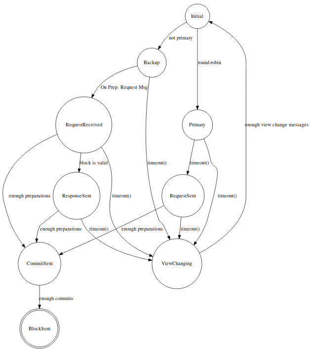

# Delegated Byzantine Fault Tolerance: Technical details, challenges and perspectives { #biz }

_This section is part of the Community Yellow Paper ^[See [Community Yellow Paper repository](https://github.com/neoresearch/yellowpaper)] initiative, a community-driven technical specification for Neo blockchain._

Various studies in the literature dealt with partially synchronous and fully asynchronous Byzantine Fault Tolerant systems [@Hao2018DynnamicPBFT; @Duan:2018:BAB:3243734.3243812; @miller2016honey], but few of them were really applied in a live Smart Contract (SC) Scenario with plenty of distinct decentralized applications.
It is noteworthy that append storage applications poses different level of challenges compared to the current need of SC transactions persisting, which involve State Machine Replication (SMR) [@schneider1990implementing].
In addition, a second important fact to be considered is related to the finality in appending information to the ledger.
Final users, merchants and exchanges want to precisely know if their transaction was definitively processed or still could be reverted.
Differently than most part of previous works in the literature, NEO blockchain [@Neo2015WP] proposed a Consensus mechanism with **one block finality** in the **first layer**.
Besides its notorious advantages for real case applications, this characteristic imposes some constraints, also additional vulnerabilities and challenges.7

This technical material posses the main goal of highlighting the main adaptions from the classical Practical
Byzantine Fault Tolerance (pBFT) to the Delegated Byzantine
Fault Tolerance currently used in the NEO blockchain core library (see [Neo Project Github](https://github.com/neo-project/neo)).
Furthermore, it describes a novel mathematical model able to verify specific consensus behavior by means of a discrete model which can simulate real cases operation.
While highlighting the positive aspects of the current NEO consensus system,  this document also has the goal of pointing out possible faults and future research & development directions.
The latter can be achieved by a combination of NEO's requirement and novel ideas in connection with well-known studies from the literature.

The remainder of this document is organized as follows.
Section \ref{subsecBackground} provides a brief background on the the classical PBFT.
Section \ref{subsecNEOdBFT} describes the key modification made from the literature for the achievement of NEO's dBFT.
Section \ref{secdBFTDetails} details the current state-of-the-art of the NEO dBFT ongoing discussions, presenting didactic pseudocodes and flowcharts.
Finally, Section \ref{subsec:dBFT_MILP} proposes a novel mathematical programming model based on Linear Integer Programming, that models an optimal adversary that will challenge network and verify its limitations on worst case scenarios.

## Background on Practical BFT {#subsecBackground}

Practical BFT was first made possible by the work of Miguel Castro and Barbara Liskov (see Figure \ref{fig:bliskov}), entitled "Practical Byzantine Fault Tolerance" [@castro1999practical].

{height=200px}

Given $n=3f+1$ replicas of a State Machine, organized as Primary and Backup nodes, the proposed algorithm guarantees _liveness_ and _safety_ to the network, if at most $f$ nodes are faulty/byzantine^[The name Byzantine refers to arbitrary behavior, and was coined by Leslie Lamport and others on paper "The Byzantine Generals Problem"].

* Safety property ensures that all processes will execute as atomic, either executing on all nodes, or reverting as a whole. This is possible due to the deterministic nature of the process (executed on every node), which is also valid for NEO network and blockchain protocols on general.

* Liveness guarantees that network won't be stopped (unless more than $f$ byzantine nodes), by using a mechanism called "change view", that allows Backup nodes to switch Primary node when it seems byzantine. A timeout mechanism is used, and by doubling delays exponentially at every view, PBFT can prevent attacks from malicious network delays that cannot grow indefinitely.

The considered network on PBFT assumes that it "may fail to deliver messages, delay them, duplicate them, or deliver them out of order". They also considered public-key cryptography to validate identify of replicas, which is also the same for NEO dBFT. Since algorithm does not rely on synchrony for safety, it must rely on it for liveness^[This was demonstrated by paper "Impossibility of distributed consensus with one faulty process"].
The resiliency of $3f+1$ is optimal for a Byzantine Agreement [@BrachaToueg1985], with at most $f$ malicious nodes.

PBFT correctness is guaranteed by having three different phases: pre-prepare, prepare and commit^[NEO dBFT 2.0 also consists of three phases, with a slight naming change: prepare request, prepare response, and commit ].

* On pre-prepare, primary sends a sequence number $k$ together with message $m$ and signed digest $d$.
Backup $i$ accept pre-prepare if signature is correct, $k$ is in valid interval^[A special technique avoids the exhaustion of sequence number space by faulty primary], and $i$ has not yet accepted a pre-prepare for same $k$ and same view.

* When pre-prepare is accepted, a prepare message is broadcast (including to primary), and node is considered `prepared` when it receives at least $2f$ prepare messages that match its pre-prepare, for the same view.
So, at this point, for a given view, the non-faulty replicas already agree on total order for requests.
As soon as $f+1$ non-faulty are `prepared`, network is `committed`.

* Every `prepared` replica broadcasts a commit message, and as soon as node $i$ has received $2f+1$ commit messages, node $i$ is `committed-local`. It is guaranteed that, eventually, even with the occurrence of change views, a system with `committed-local` nodes with become `committed`. 

PBFT considers that clients interact and broadcast messages directly to the primary node, then receiving independent responses from 2f+1 nodes in order to move forward (to the next operation).
This is a similar situation for NEO blockchain, where information is spread by means of a peer-to-peer network, but in this case, the location of consensus nodes is unknown (in order to prevent direct delay attacks and denial of service).
One difference is that, for PBFT, clients submit atomic and independent operations for a unique timestamp, which are processed and published independently. For NEO blockchain, consensus nodes have to group transactions into batches, called blocks, and this process may lead to the existance of thousands valid blocks for a same height, due to different groupings (different combinations of transactions). So, in order to guarantee block finality (a single and unique block can exist in a given height), we may have to consider situations where the "client" (block proposer) is also faulty, which is not considered on PBFT.

## NEO dBFT core modifications {#subsecNEOdBFT}

 We highlight some differences between PBFT and dBFT:

* One block finality to the end-users and seed nodes;
* Use of cryptographic signatures during different phases of the procedures in order to avoid exposure of nodes commitment to the current block;
* Ability of proposing blocks based information sharing of block headers;
* Avoid double exposure of block signatures by disable change views after commitment phase;
* Regeneration mechanism able to recover failed nodes both in local hardware and software P2P consensus layer.

<!-- In this sense, novel tools and strategies can still be incorporated in the current dBFT in order to design an even more robust and reliable multi-agent agent based consensus mechanism. -->

## dBFT detailed description {#secdBFTDetails}

The dBFT consensus mechanism is a state machine, with transitions depending on a round-robin scheme (to define Primary/Backup nodes) and also depending on network messages.

### dBFT states

dBFT states are the following:

* Initial : initial machine state

* Primary : depends on block height and view number

* Backup : true if not primary, false otherwise

* RequestSent : true if block header has been proposed, false otherwise

* RequestReceived : true if block header has been received, false otherwise

* ~~SignatureSent : true if signature has been sent, false otherwise~~ (removed on dBFT 2.0 because of extra commit phase carrying signatures)

* ResponseSent : true if block header confirmation has been sent (such block pre-confirmation was only introduced on dBFT 2.0)

* CommitSent : true if block signature has been sent (this state was only introduced on dBFT 2.0 and replaced SignatureSent)

* BlockSent : true if block has been sent, false otherwise

* ViewChanging : true if view change mechanism has been triggered, false otherwise

The first dBFT handled these states explicitly as flags (ConsensusState enum).
However, dBFT 2.0 can infer this information in a implicit manner, since it has added state recovery mechanisms.

## Flowchart

Figure \ref{fig:dbft-sm} presents the State Machine replicated on each consensus node (the term _replica_ or _node_ or _consensus node_ may be considered synonims on this subsection).
The execution flow of a State Machine replica begins on the `Initial` state, for a given block height `H` on the blockchain.
Given `H`, a round-robin procedure detects if current replica is...

~~~~ graphviz
digraph dBFT {
        //rankdir=LR;
        size="11";
	node [shape = circle]; Initial;
	node [shape = doublecircle]; BlockSent;
	node [shape = circle];
	Initial -> Primary [ label = "round-robin" ];
	Initial -> Backup [ label = "not primary" ];
	Primary -> RequestSent [ label = "timeout(blockTime)" ];
	Backup -> RequestReceived [ label = "On Prep. Request Msg" ];
	RequestReceived -> ResponseSent [ label = "block is valid" ];
	RequestReceived -> ViewChanging [ label = "timeout()" ];
	Primary -> ViewChanging [ label = "timeout()" ];
	Backup -> ViewChanging [ label = "timeout()" ];
	ResponseSent -> ViewChanging [ label = "timeout()" ];
	RequestSent -> ViewChanging [ label = "timeout()" ];
	ResponseSent -> CommitSent [ label = "enough preparations" ];
	RequestSent -> CommitSent [ label = "enough preparations" ];
	RequestReceived -> CommitSent [ label = "enough preparations" ];
	CommitSent -> BlockSent [ label = "enough commits" ];
	ViewChanging -> Initial [ label = "enough view change messages" ];
}
~~~~~~~~~~~~

{width=600px}

## Pseudocode

## Signatures sharing
We consider that nodes can share any valid signature (invalid cases are easy to detect on Section \ref{subsecpureByzantineFault}).

In this sense, we highlight here a decentralized P2P network (fully distributed), in which nodes try to inform each other as much as they can about any useful state.
The trade-off that borders the discussions is the use bandwidth while the notorious advantage is the creation and optimization of the best communication routes between entities.

## Block finality {#subSecblockFinality}

Block finality in the Consensus layer level imposes the following condition presented at Eq. \eqref{eq:blockFinality}, which defines that there should not exist two different blocks for a given height $h$, in any time interval $t$.

\begin{equation}
    \forall h \in \{0,1, \cdots, t\} \Rightarrow b_t^i = b_t^j
    \label{eq:blockFinality}
\end{equation}

In summary, the block finality provides that clients do not need to verify the majority of Consensus for SMR.
In this sense, seed nodes can just append all blocks that posses the number of authentic signatures defined by the protocol.

For the current NEO dBFT, the minimum number of required signatures is $M = 2f$ (as defined in The Byzantine Generals Problems @lamport1982byzantine), where $f = \frac{1}{3} \times N$ is the maximum number of Byzantine nodes allowed by the network protocol.

## Multiple block signature exposure

### Detected fault on dBFT v1.0
Known Block Hash stuck fork was recently discovered in real operation of NEO blockchain, 2017.

In particular, this happens due to two components of the Blocks that are selected by each node that is a primary:

* Different sets of Transactions;
* Block Nonce.

In particular, the NEO dBFT 1.0 had a simplified implementation of the pBFT without the commit stage.

However, it was detected that under rare situations a given node could receive the desired `M` signatures necessary for persisting a Block and, then, suddenly, lose connection with other nodes.
In this sense, the other nodes could detect a lack of communication (along with other fails between themselves) and generate a new block.
Besides breaking block finality \ref{subSecblockFinality}, this problem can stuck the consensus node and any client that persists the block that was not adopted by the majority of CN.
In addition, in a even more rare situation, $x$ nodes with $ f + 1 < x < M $ could receive a given block while the other nodes had a different block hash, stucking the whole network until a manual decision was reached.

It is noteworthy that even in an Asynchronous Consensus without timeout mechanism this case could lead to problems if the Nonce was not yet defined as well as the transactions to be inserted inside a Block.

### Commit phase with change view blocking

Taking into account that the aforementioned faulty could happen even with the commit phase, one should verify that nodes could stuck but not double expose its signature.
On the other hand, other attacks could happen if malicious nodes tried to save the signature and perform specific communications.

In this sense, the possibility that naturally came was:

* Lock view changing ( currently implemented in the NEO dBFT) after sending your signature. This means that those who commit with that block will not sign any other proposed Block.

While, on the other hand, a regeneration strategy sound compulsory to be implemented.

## Regeneration

The Recover/Regeneration event is designed for responding to a given failed node that lost part of the history.
In this sense, if the node had failed and recovered its healthy (sending a change\_view payload) it might receive a payload that provides it the ability to check agreements of the majority and come back to real operation, helping them to sign the current block being processed.
In addition, a local level of safety (which can be seen as a hardware faulty safety) should be ensured for avoiding other special attacks and possible fails.

Following this both requirements, dBFT 2.0 counted with a set of diverse cases in which a node could recover it previous state, both previously known by the network or by itself.

## Possible faults

### Pure network faults

Possible scenarios:

* `f` nodes will delays messages;
* At maximum, `f` will crash both in terms of hardware fault or software problems.

### Pure byzantine faults {#subsecpureByzantineFault}

First of all, Byzantine attacks should be designed in order that nodes will never be able to prove that it was an attack.

Obviously, nodes that join a given collaborative network posses an identity or stake.
In this sense, if anyone can detect this kind of behavior then that node will automatically be removed from the network.

* at maximum, $f$, nodes will delays messages;
* at maximum, $f$, nodes will store messages;
* at maximum, $f$, nodes will send wrong information;
* at maximum, $f$, nodes will try to keep correct information for strategic occasions.

## A MILP Model for Failures and Attacks on a BFT Blockchain Protocol {#subsec:dBFT_MILP}

We present a MILP model for failures and attacks on a BFT blockchain protocol.

Parameters:

$i \in R$

: consensus replica $i$ from set of replicas $R$. $R^{BYZ}$ is byzantine set. $R^{OK}$ is non-byzantine set. $R = R^{OK} \cup R^{BYZ}$, such that $R^{OK} \cap R^{BYZ} = \emptyset$.

$f$

: number of faulty/Byzantine replicas. $f = |R^{BYZ}|$.

$N$

: total number of replicas. $N = |R| = |R^{OK}| + |R^{BYZ}| = 3f + 1$.

$M$

: safety level. $M = 2f + 1$.

$b \in B$

: block $b$ from set of possible proposed blocks $B$ (may be understood as block hash).  $B = \{b_0, b_1, b_2, \cdots \}$.

$h \in H$

: height $h$ from set of possible heights $H$ (tests may only require two or three heights). $H = \{h_0, h_1, h_2\}$. Multiple heights are considered, such that block generation can be simulated over a bigger horizon (including primary changes).

$v \in V$

: view $v$ from set of possible views $V$ (number of views may be limited to the number of consensus nodes $N$). $V = \{v_0, v_1, \cdots , v_{N-1}\}$

$t \in T$

: time unit $t$ from set of discrete time units $T$. $T = \{t_0, t_1, t_2,  \cdots \}$.

Variables:

$primary_{i,h,v}$

: binary variable that indicates if Consensus Node $i$ is primary at height $h$ view $v$.

$initialized^{t}_{i, h, v}$

: binary variable that indicates if replica $i \in R$ is at height $h$ and view $v$, on time $t$

$SendPrepReq^{t}_{i, h, b, v}$

: binary variable that indicates if replica $i \in R$ is sending Prepare Request message (to all nodes) at height $h$ and view $v$, on time $t$, for proposed block $b$. ACTION VARIABLE MUST BE SET ONLY ONCE FOR EVERY REPLICA, HEIGHT AND BLOCK.
% Nao entendi esse only once, faltou o View na descricao, nao? Caso o view seja outro ela pode ser setada denovo

$SendPrepResp^{t}_{i, h, b, v}$

: binary variable that indicates if replica $i \in R$ is sending Prepare Response message (to all nodes) at height $h$ and view $v$, on time $t$, for proposed block $b$. ACTION VARIABLE MUST BE SET ONLY ONCE FOR EVERY REPLICA, HEIGHT AND BLOCK.

$RecvPrepReq^{t}_{i, j, h, b, v}$

: binary variable that indicates if replica $i \in R$ received a Prepare Request message from replica $j$ at height $h$ and view $v$, on time $t$, for proposed block $b$. ACTION VARIABLE MUST BE SET ONLY ONCE FOR EVERY REPLICA, HEIGHT AND BLOCK.

$RecvPrepResp^{t}_{i, j, h, b, v}$

: binary variable that indicates if replica $i \in R$ received a Prepare Response message from replica $j$ at height $h$ and view $v$, on time $t$, for proposed block $b$. ACTION VARIABLE MUST BE SET ONLY ONCE FOR EVERY REPLICA, HEIGHT AND BLOCK.

$BlockRelay^t_{i, h, b}$

: binary variable that indicates if replica $i$ has relayed block $b$ at height $h$, on time $t$. ACTION VARIABLE MUST BE SET ONLY ONCE FOR EVERY REPLICA, HEIGHT AND BLOCK.

$RecvBlkPersist^{t}_{i, j, h, b}$

: binary variable that indicates if replica $i \in R$ received a Block Relay message from replica $j$ at height $h$ on time $t$, for proposed block $b$. ACTION VARIABLE MUST BE SET ONLY ONCE FOR EVERY REPLICA, HEIGHT AND BLOCK.

$sentPrepReq^{t}_{i, h, b, v}$

: binary variable that indicates if replica $i \in R$ has sent (in past) to all replicas a Prepare Request message at height $h$ and view $v$, on time $t$, for proposed block $b$. Once set to ONE this is carried forever as ONE.

$sentPrepResp^{t}_{i, h, b, v}$

: binary variable that indicates if replica $i \in R$ has sent (in past) to all replicas a Prepare Response message at height $h$ and view $v$, on time $t$, for proposed block $b$. Once set to ONE this is carried forever as ONE.

$recvdPrepReq^{t}_{i, j, h, b, v}$

: binary variable that indicates if replica $i \in R$ has received (in past) from replica $j$ a Prepare Request message at height $h$ and view $v$, on time $t$, for proposed block $b$. Once set to ONE this is carried forever as ONE.

$recvdPrepResp^{t}_{i, j, h, b, v}$

: binary variable that indicates if replica $i \in R$ has received (in past) from replica $j$ a Prepare Response message at height $h$ and view $v$, on time $t$, for proposed block $b$. Once set to ONE this is carried forever as ONE.

$sentBlkPersist^{t}_{i, h, b}$

: binary variable that indicates if replica $i \in R$ has sent (in past) to all replicas a Block Relay message at height $h$, on time $t$, for proposed block $b$. Once set to ONE this is carried forever as ONE.
% Nao se assumi que um byzantine poderia dar dois relays diferentes em views distintos?

$recvdBlkPersist^{t}_{i, j, h, b}$

: binary variable that indicates if replica $i \in R$ has received (in past) from replica $j$ a Block Relay message at height $h$, on time $t$, for proposed block $b$. Once set to ONE this is carried forever as ONE.

$blockRelayed_{b}$

: binary variable that indicates if block $b$ was relayed (on any time, height or view).

Objective function:

(@obj) $maximize \sum_{b \in B} blockRelayed_{b}$

The adversary can control $f$ replicas, but the other $M$ replicas must follow dBFT algorithm.
The adversary can choose any delay for any message (up to maximum simulation time $|T|$).
If it wants to shutdown the whole network, no blocks will be ever produced and objective will be zero (minimum possible).
So, adversary will try to maximize blocks produced by manipulating delays in a clever way.
As described by Eq. (@obj), objective function is bounded to [$0$, $|B|$].

Constraints:

Initialization constraints
\begin{align}
    % initializing all good replicas in time zero, height zero, view zero (Byzantine can start in any configuration)
    initialized^{t_0}_{i, h_0, v_0} = 1 & \qquad \forall i \in R^{OK}\\
    initialized^{t_0}_{i, h, v} = 0 & \qquad \forall i \in R^{OK}, h \in H \backslash \{h_0\}, v \in V \backslash \{v_0\}\\
    %only one view can be initialized at a time
    \sum_{v \in V} initialized^{t}_{i, h, v} = 1 & \qquad \forall i \in R, t \in T \backslash \{t_0\}, h \in H\\
    %only one height can be initialized at a time
    \sum_{h \in H} initialized^{t}_{i, h, v} = 1 & \qquad \forall i \in R, t \in T \backslash \{t_0\}, v \in V
\end{align}

Time zero constraints:
\begin{align}
    % cannot prep req on time zero
    SendPrepReq^{t_0}_{i, h, b, v} = 0 & \qquad \forall i \in R, \forall h, b, v\\
    % sent prep request did not happen on time zero
    sentPrReq^{t_0}_{i, h, b, v} = 0 & \qquad \forall h, b, i, v\\
    % cannot receive prep req on time zero
    RecvPrepReq^{t_0}_{i, j, h, b, v} = 0 & \qquad \forall i, j \in R, \forall h, b, v\\
    % received prep req did not happen on time zero
    recvdPrReq^{t_0}_{i, j, h, b, v} = 0 & \qquad \forall j, h, b, i, v\\
    % cannot send prep response on time zero
    SendPrepResp^{t_0}_{i, h, b, v} = 0 & \qquad \forall i \in R, \forall h, b, v\\
    % sent prep response did not happen on time zero
    sentPrResp^{t_0}_{i, h, b, v} = 0 & \qquad \forall h, b, i, v\\
    % cannot receive prep resp on time zero
    RecvPrepResp^{t_0}_{i, j, h, b, v} = 0 & \qquad \forall i,j \in R, \forall h, b, v\\
    % received prep resp did not happen on time zero
    recvdPrResp^{t_0}_{i, j, h, b, v} = 0 & \qquad \forall j, h, b, i, v\\
    % cannot relay block on time zero
    BlockRelay^{t_0}_{i, h, b} = 0 & \qquad \forall i \in R, \forall h, b\\
    % sent block persist did not happen in time zero
    sentBlkPersist^{t_0}_{i,h,b} = 0 & \qquad \forall i \in R,\forall h, b\\
    % cannot receive block persist on time zero
    RecvBlkPersist^{t_0}_{i, j, h, b} = 0 & \qquad \forall i, j \in R, \forall h, b\\
    % received block persist did not happen in time zero
    recvdBlkPersist^{t_0}_{i,j,h,b} = 0 & \qquad \forall i,j \in R,\forall h, b\\
\end{align}

Prepare request constraints:
\begin{align}
    % can send prep req only if initialized
    SendPrepReq^{t}_{i, h, b, v} \leq initialized^t_{i, h, v} & \qquad \forall i, h, b, v, t\\
    % can send prep req only if primary
    SendPrepReq^{t}_{i, h, b, v} \leq primary_{i, h, v} & \qquad \forall i, h, b, v, t\\
    % sent prep request from i to j, subject to send i in past time
    sentPrReq^{t}_{i, h, b, v} = sentPrReq^{t-1}_{i, h, b, v} + SendPrepReq^{t-1}_{i, h, b, v} & \qquad \forall h, b, i, v, t \in T \backslash \{t_0\}\\
    % received prep req on i from j, only if sent from j to i (in past time)
    RecvPrReq^{t}_{i, j, h, b, v} \leq sentPrReq^{t}_{j, h, b, v} & \qquad \forall h, b, i \neq j, v, t\\
    % self received prep req
    RecvPrReq^{t}_{i, i, h, b, v} = SendPrepReq^{t}_{i, h, b, v} & \qquad \forall h, b, i, v, t\\
    % if received in past time, keep variable received
    recvdPrReq^{t}_{i, j, h, b, v} = recvdPrReq^{t-1}_{i, j, h, b, v} + RecvPrReq^{t-1}_{i, j, h, b, v} & \qquad \forall h, b, i, j, v, t \in T \backslash \{t_0\}
\end{align}

Prepare response constraints:
\begin{align}
    % can send prep resp only if initialized
    SendPrepResp^{t}_{i, h, b, v} \leq initialized^t_{i, h, v} & \qquad \forall i, h, b, v, t\\
    % will send prepare response if received any prepare request (OK nodes) 1/N will force up!
    SendPrepResp^{t}_{i, h, b, v} \geq \frac{1}{N}\sum_{j \in R} recvdPrReq^{t-1}_{i, j, h, b, v} & \qquad \forall i \in R^{OK}, h, b, v, t\\
    % may send prepare response only if received any prepare request
    SendPrepResp^{t}_{i, h, b, v} \leq \sum_{j \in R} recvdPrReq^{t-1}_{i, j, h, b, v} & \qquad \forall i \in R, h, b, v, t\\
    % sent prep response from i, subject to send i in past time
    sentPrResp^{t}_{i, h, b, v} = sentPrResp^{t-1}_{i, h, b, v} + SendPrepResp^{t-1}_{i, h, b, v} & \qquad \forall h, b, i, v, t \in T \backslash \{t_0\}\\
    % received prep resp on i from j, only if sent from j to i (in past time)
    RecvPrResp^{t}_{i, j, h, b, v} \leq sentPrResp^{t}_{j, h, b, v} & \qquad \forall h, b, i \neq j, v, t\\
    % self received prep resp
    RecvPrResp^{t}_{i, i, h, b, v} = SendPrepResp^{t}_{i, h, b, v} & \qquad \forall h, b, i, v, t\\
    % if received in past time, keep variable received
    recvdPrResp^{t}_{i, j, h, b, v} = recvdPrResp^{t-1}_{i, j, h, b, v} + RecvPrResp^{t-1}_{i, j, h, b, v} & \qquad \forall h, b, i, j, v, t \in T \backslash \{t_0\}
\end{align}

Block persist constraints:
\begin{align}
    % sent persist message to all, after BlockRelay
    sentBlkPersist^t_{i,h,b} = sentBlkPersist^{t-1}_{i,h,b} + BlockRelay^{t-1}_{i,h,b} & \qquad \forall i \in R, h, b, t\\
    % received Block Relay on i from j, only if sent from j to i (in past time)
    RecvBlkPersist^{t}_{i, j, h, b} \leq sentBlkPersist^{t}_{j, h, b} & \qquad \forall h, b, i \neq j, v, t\\
    % self received persist block
    RecvBlkPersist^{t}_{i, i, h, b} = BlockRelay^{t}_{i, h, b} & \qquad \forall h, b, i, t\\
    % if received in past time, keep variable received
    recvdBlkPersist^{t}_{i, j, h, b} = recvdBlkPersist^{t-1}_{i, j, h, b} + RecvBlkPersist^{t-1}_{i, j, h, b} & \qquad \forall h, b, i, j, t \in T \backslash \{t_0\}
\end{align}

Block relay constraints:
\begin{align}
    % for every replica and height, a single block can be relayed
    \sum_{t \in T} BlockRelay^t_{i,h,b} \leq 1 & \qquad \forall i \in R, \forall h, b \\
    %blockRelayed b only if relayed in time t height h
    blockRelayed_b \geq \frac{1}{N|H|} \sum_{t \in T}\sum_{i \in R}\sum_{h \in H} BlockRelay^t_{i,h,b} & \qquad \forall b \in B\\
    % if received M signatures until t-1, can relay block at time t
    BlockRelay^t_{i,h,b} \leq \frac{1}{M} \sum_{j \in R} recvdPrResp^{t-1}_{i,j,h,b,v} + \sum_{j \in R} recvdBlkPersist^t_{i,j,h,b} & \qquad \forall i \in R, h, b, v, t
\end{align}

## Example

&nbsp;\newline

Fixed values presented in bold.

$initialized^t_{i,h,v}$, for $i \in R^{OK}$, $h=0$, $v=0$:
\begin{tabular}{c|c|c|c|c|c|c|}
\cline{2-7}
i=0 & {\bf 1} & 1 & 1 & 1 & 1 & ... \\\cline{2-7}
t           & 0 & 1 & 2 & 3 & 4 & ...\\\cline{2-7}
\end{tabular}

\begin{minipage}[t]{.5\textwidth}
$primary_{i,h,v}$, $h=0$:\\
\begin{tabular}{c|c|c|c|c|}
\cline{2-5}
i=0 & {\bf 1} & {\bf 0} & {\bf 0} & ... \\\cline{2-5}
i=1 & {\bf 0} & {\bf 1} & {\bf 0} & ... \\\cline{2-5}
i=2 & {\bf 0} & {\bf 0} & {\bf 1} & ... \\\cline{2-5}
v           & 0 & 1 & 2 &...\\\cline{2-5}
\end{tabular}
\end{minipage}
\begin{minipage}[t]{.5\textwidth}
$primary_{i,h,v}$, $h=1$:\\
\begin{tabular}{c|c|c|c|c|}
\cline{2-5}
i=0 & {\bf 0} & {\bf 1} & {\bf 0} & ... \\\cline{2-5}
i=1 & {\bf 0} & {\bf 0} & {\bf 1} & ... \\\cline{2-5}
i=2 & {\bf 0} & {\bf 0} & {\bf 0} & ... \\\cline{2-5}
v           & 0 & 1 & 2 &...\\\cline{2-5}
\end{tabular}
\end{minipage}

$SendPrepReq^t_{i,h,b,v}$, for $i=0$, $h=0$, $b=0$, $v=0$:
\begin{tabular}{c|c|c|c|c|c|c|c|c|c|}
\cline{2-10}
SendPrepReq(i=0) & {\bf 0} & 0 & 1 & 0 & 0 & 0 & 0 & 0 & ... \\\cline{2-10}
t           & 0 & 1 & 2 & 3 & 4 & 5 & 6 & 7 & ...\\\cline{2-10}
\end{tabular}

$sentPrepReq^t_{i,h,b,v}$, i=0, $h,b,v=0$:
\begin{tabular}{c|c|c|c|c|c|c|c|c|c|}
\cline{2-10}
(i=0) & {\bf 0} & 0 & 0 & 1 & 1 & 1 & 1 & 1 & ... \\\cline{2-10}
t           & 0 & 1 & 2 & 3 & 4 & 5 & 6 & 7 & ...\\\cline{2-10}
\end{tabular}

\begin{minipage}[t]{.5\textwidth}
$recvdPrepReq^t_{i,j,h,b,v}$, for i=0,j=0, $h,b,v=0$:\\
\begin{tabular}{c|c|c|c|c|c|c|c|c|c|}
\cline{2-10}
- & {\bf 0} & 0 & 0 & 1 & 1 & 1 & 1 & 1 & ... \\\cline{2-10}
t           & 0 & 1 & 2 & 3 & 4 & 5 & 6 & 7 & ...\\\cline{2-10}
\end{tabular}
\end{minipage}
\begin{minipage}[t]{.5\textwidth}
$recvdPrepReq^t_{i,j,h,b,v}$, i=0,j=1, $h,b,v=0$:\\
\begin{tabular}{c|c|c|c|c|c|c|c|c|c|}
\cline{2-10}
- & {\bf 0} & 0 & 0 & 1 & 1 & 1 & 1 & 1 & ... \\\cline{2-10}
t           & 0 & 1 & 2 & 3 & 4 & 5 & 6 & 7 & ...\\\cline{2-10}
\end{tabular}
\end{minipage}

## Section References

&nbsp;\newline
